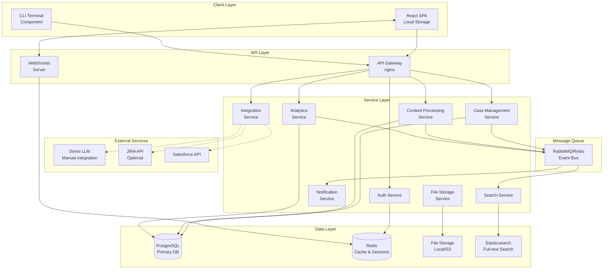
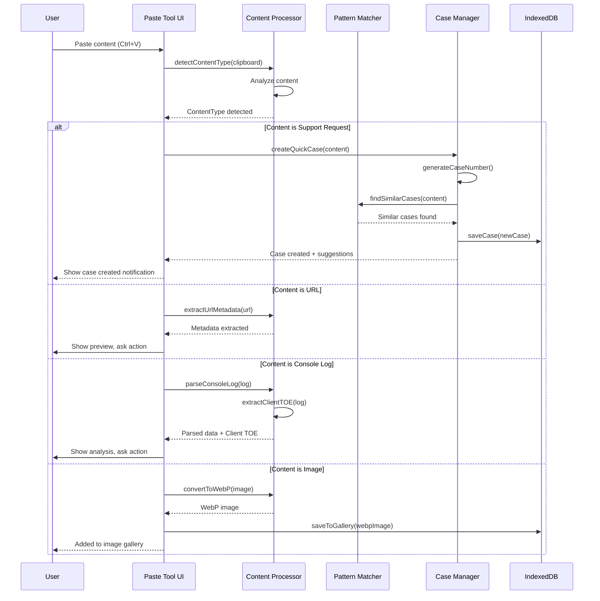
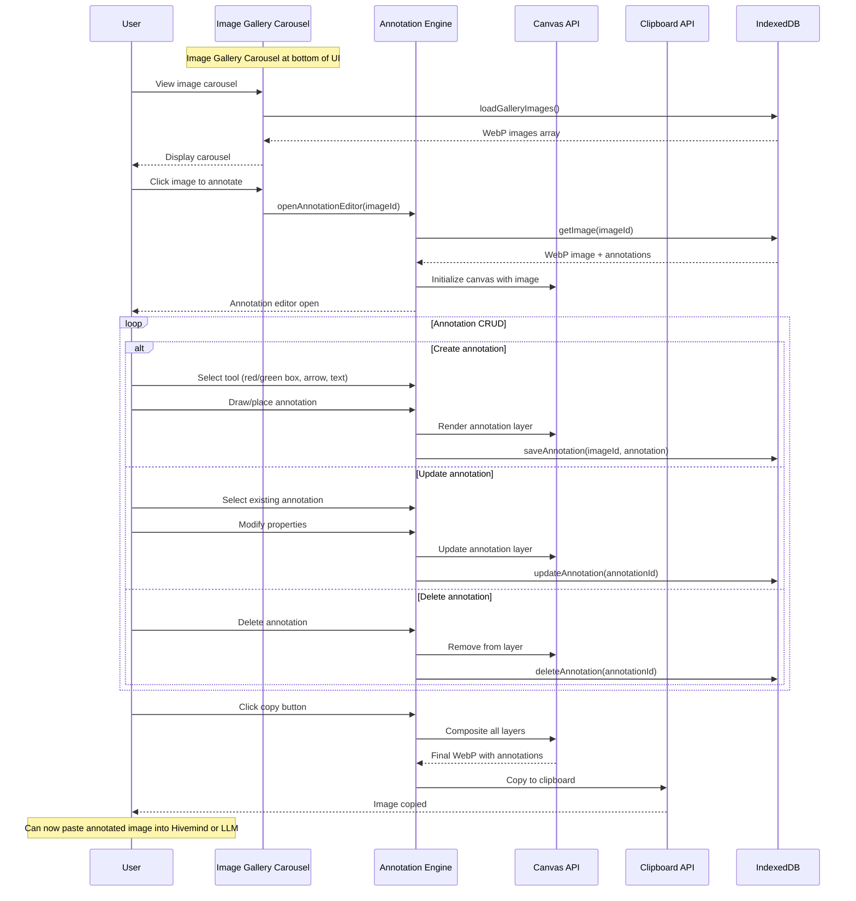
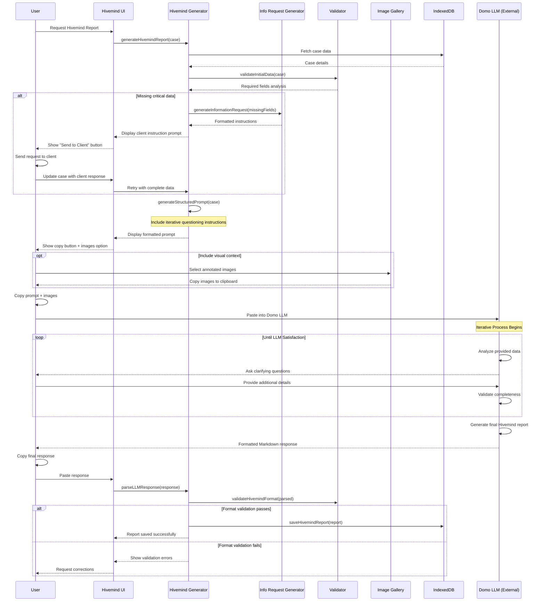
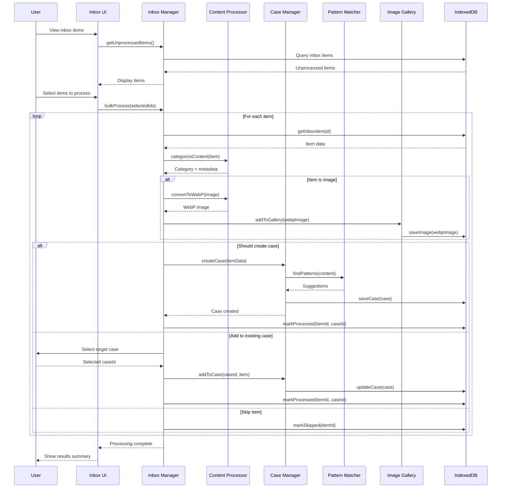

# Smart Support Agent Application Architecture Document

## Introduction

This document outlines the overall project architecture for Smart Support Agent Application, including backend systems, shared services, and non-UI specific concerns. Its primary goal is to serve as the guiding architectural blueprint for AI-driven development, ensuring consistency and adherence to chosen patterns and technologies.

**Relationship to Frontend Architecture:**
If the project includes a significant user interface, a separate Frontend Architecture Document will detail the frontend-specific design and MUST be used in conjunction with this document. Core technology stack choices documented herein (see "Tech Stack") are definitive for the entire project, including any frontend components.

### Starter Template or Existing Project

Based on my review of the brief.md, I can see this is a greenfield project with no mention of using a starter template or existing codebase. The project is being built from scratch as a comprehensive multi-user browser-based platform.

N/A - No starter template or existing project will be used.

### Change Log

| Date | Version | Description | Author |
|------|---------|-------------|--------|
| 2025-08-04 | 1.0 | Initial architecture document creation | Winston (Architect) |

## High Level Architecture

### Technical Summary

The Smart Support Agent Application employs a containerized microservices architecture built on Node.js and React, designed to support multi-user collaboration through intelligent automation and sophisticated case management. The system leverages PostgreSQL for primary data storage with Redis for caching and real-time features, implementing event-driven patterns for asynchronous processing and WebSocket connections for live updates. Core architectural patterns include Repository Pattern for data access, Command Query Responsibility Segregation (CQRS) for complex operations, and a manual integration pattern with Domo's LLM service to maintain security while enabling AI-enhanced features.

### High Level Overview

1. **Architectural Style**: Microservices Architecture with Event-Driven Communication
   - Chosen for scalability, independent service deployment, and team autonomy
   - Services communicate via REST APIs and message queues

2. **Repository Structure**: Monorepo
   - Single repository containing all services, shared libraries, and infrastructure
   - Enables atomic commits across services and simplified dependency management

3. **Service Architecture**: Microservices
   - Core Services: Auth Service, Case Management Service, Content Processing Service, Analytics Service, Integration Service
   - Support Services: Notification Service, File Storage Service, Search Service

4. **Primary User Interaction Flow**:
   - Users interact through React-based SPA
   - API Gateway handles routing and authentication
   - Services process requests asynchronously where appropriate
   - Real-time updates via WebSocket connections

5. **Key Architectural Decisions**:
   - **Containerization**: All services run in Docker containers for consistency
   - **Local-First Storage**: Optimize for performance with background sync
   - **Manual LLM Integration**: Security-conscious approach to AI features
   - **Event Sourcing**: For audit trails and case history

### High Level Project Diagram



### Architectural and Design Patterns

- **Microservices Architecture:** Independent services with single responsibilities - *Rationale:* Enables independent scaling, deployment, and team ownership while supporting the complex feature set
- **Repository Pattern:** Abstract data access logic across all services - *Rationale:* Enables testing, maintains consistency, and allows future database migration flexibility
- **Event-Driven Communication:** Using message queues for service decoupling - *Rationale:* Supports async processing, system resilience, and enables real-time features
- **CQRS Pattern:** Separate read and write models for complex operations - *Rationale:* Optimizes performance for analytics and reporting while maintaining data integrity
- **API Gateway Pattern:** Single entry point for all client requests - *Rationale:* Centralizes authentication, routing, and cross-cutting concerns
- **Circuit Breaker Pattern:** Fault tolerance for external service calls - *Rationale:* Prevents cascade failures when integrating with Domo, Salesforce, or other external APIs
- **Local-First with Sync:** Client-side storage with background synchronization - *Rationale:* Provides instant UI response and offline capability while maintaining data consistency
- **Manual LLM Integration Pattern:** Copy-paste workflow with structured prompts - *Rationale:* Maintains security boundaries while leveraging AI capabilities

## Tech Stack

This is the **DEFINITIVE** technology selection section. All technology choices made here are binding for the entire project and must be referenced by all other documentation.

### Infrastructure Approach
- **Provider:** Local/Browser-based (No cloud provider)
- **Key Services:** Browser APIs (IndexedDB, LocalStorage, File System Access API)
- **Deployment:** Static file hosting or local file system

### Technology Stack Table

| Category | Technology | Version | Purpose | Rationale |
|----------|------------|---------|---------|-----------|
| **Language** | TypeScript | 5.3.3 | Primary development language | Strong typing, excellent tooling, unified across stack |
| **Runtime** | Browser JavaScript | ES2022+ | Client-side execution | No server runtime needed for local-first approach |
| **Build Tool** | Vite | 5.1.0 | Fast development and optimized builds | Modern, fast, excellent for SPA development |
| **Frontend Framework** | React | 18.2.0 | UI framework | Component-based, large ecosystem, matches brief requirements |
| **State Management** | Zustand | 4.5.0 | Global state management | Lightweight, TypeScript-friendly, perfect for local-first apps |
| **Local Database** | Dexie.js | 3.2.4 | IndexedDB wrapper | Powerful queries, TypeScript support, reactive |
| **UI Components** | Tailwind CSS | 3.4.1 | Styling framework | Utility-first, fast development, small bundle size |
| **Component Library** | Headless UI | 1.7.17 | Accessible components | Unstyled, accessible, works great with Tailwind |
| **File Handling** | File System Access API | Native | Local file read/write | Browser native API for file operations |
| **Testing** | Manual/LLM | N/A | Simple testing approach | AI-assisted testing through prompts and verification |
| **Terminal Component** | xterm.js | 5.3.0 | Browser terminal emulator | Full-featured terminal in the browser |
| **Image Processing** | Canvas API | Native | Image annotation | Browser native for image manipulation |
| **Search** | Flexsearch | 0.7.31 | Full-text search | In-browser search, no server needed |
| **Rich Text** | Lexical | 0.13.1 | Text editor framework | Facebook's modern editor, great for case notes |
| **Markdown** | marked | 12.0.0 | Markdown parsing | For formatting case descriptions and reports |
| **Data Sync** | N/A | N/A | No sync needed | Fully local, no backend required |
| **Package Manager** | npm | 10.2.4 | Dependency management | Standard for JavaScript projects |
| **Bundler** | Rollup (via Vite) | 4.9.6 | Production builds | Tree-shaking, code splitting |
| **Development Server** | Vite Dev Server | 5.1.0 | Local development | HMR, fast refresh |
| **Linting** | ESLint | 8.56.0 | Code quality | Catch errors, enforce conventions |
| **Formatting** | Prettier | 3.2.4 | Code formatting | Consistent code style |

## Data Models

Based on the Smart Support Agent Application requirements, here are the core data models that will be stored in IndexedDB:

### Case
**Purpose:** Central entity representing a support case from creation to resolution

**Key Attributes:**
- id: string (UUID) - Unique case identifier
- caseNumber: string - 8-digit case number (e.g., "05907169")
- title: string - Brief case description
- description: string - Detailed case information
- status: enum - pending | in_progress | resolved | closed
- priority: enum - low | medium | high | critical
- classification: enum - error | query | feature_request
- createdAt: timestamp - Case creation time
- updatedAt: timestamp - Last modification time
- createdBy: string - Agent who created the case
- assignedTo: string - Currently assigned agent
- customerId: string - Reference to customer
- salesforceNumber: string - 8-digit Salesforce case number
- jiraTickets: string[] - JIRA ticket references (DOMO-456837, HIVE-2263 formats)
- tags: string[] - Categorization tags
- artifacts: string[] - References to attached files
- inboxItems: string[] - Related inbox items

**Relationships:**
- Has many CaseEvents (history/audit trail)
- Has many CaseArtifacts (attachments)
- Belongs to Customer
- Has many InboxItems

### Customer
**Purpose:** Maintain customer relationships and interaction history (privacy-compliant)

**Key Attributes:**
- id: string (UUID) - Unique identifier
- firstName: string - First name only (privacy)
- companyName: string - Organization name
- relationshipScore: number - Interaction quality metric
- firstContactDate: timestamp - Initial interaction
- lastContactDate: timestamp - Most recent interaction
- communicationPreferences: object - Preferred contact methods
- notes: string - Agent notes about customer
- tags: string[] - Customer categorization

**Relationships:**
- Has many Cases
- Has many InteractionLogs

### InboxItem
**Purpose:** Raw content items that can be processed into cases or attached to existing cases

**Key Attributes:**
- id: string (UUID) - Unique identifier
- type: enum - text | url | image | console_log | email
- content: string - Raw content or reference
- metadata: object - Type-specific metadata
- processed: boolean - Processing status
- processedAt: timestamp - When processed
- caseId: string? - Linked case if processed
- priority: enum - low | medium | high
- createdAt: timestamp - Creation time
- source: string - Origin of item
- tags: string[] - Auto-generated tags

**Relationships:**
- May belong to Case
- Has ProcessingResult

### CaseArtifact
**Purpose:** Files and processed content attached to cases

**Key Attributes:**
- id: string (UUID) - Unique identifier
- caseId: string - Parent case
- type: enum - image | document | log | screenshot
- fileName: string - Original file name
- mimeType: string - File MIME type
- size: number - File size in bytes
- content: Blob - Actual file content
- annotations: object? - Image annotations data
- metadata: object - Extracted metadata
- createdAt: timestamp - Upload time
- createdBy: string - Uploading agent

**Relationships:**
- Belongs to Case
- May have Annotations

### HivemindReport
**Purpose:** Structured reports for internal compliance and product meetings

**Key Attributes:**
- id: string (UUID) - Unique identifier
- caseId: string - Source case
- title: string - Concise issue summary
- component: enum - Connect|Content|Data Transformation|Developer|Domo Everywhere|Governance|Legacy|Mobile|Other
- subComponent: string - Based on component selection
- description: string - Detailed explanation (>200 chars)
- troubleshootingDone: object - Steps performed, KB articles used, test environments
- stepsToReproduce: string[] - Numbered reproduction steps
- urls: string[] - Related URLs
- engineeringInfo: object - Error messages, logs, Client TOE
- status: enum - draft | pending_review | submitted
- llmPrompt: string? - Generated prompt for LLM
- llmResponse: string? - LLM response
- parsedData: object? - Parsed response
- validationResults: object? - Validation checks
- iterationHistory: object[] - Questions/responses during LLM interaction
- questionsAsked: string[] - All questions asked during process
- userResponses: object[] - All user responses with timestamps
- iterationCount: number - Number of back-and-forth cycles
- satisfactionConfirmed: boolean - LLM confirmed data completeness
- finalValidation: object - Final validation results
- createdAt: timestamp - Creation time
- submittedAt: timestamp? - Submission time

**Relationships:**
- Belongs to Case
- Has ValidationResults

### ImageGallery
**Purpose:** Store WebP images with annotations in carousel interface

**Key Attributes:**
- id: string (UUID) - Unique identifier
- caseId: string? - Optional case association
- webpData: blob - WebP image data
- originalFormat: string - Original format (png, jpg, etc.)
- thumbnailData: blob - Small WebP thumbnail
- width: number - Image width
- height: number - Image height
- fileSize: number - File size in bytes
- tags: string[] - Image categorization
- uploadedAt: timestamp - Upload time
- lastAnnotated: timestamp? - Last annotation time

**Relationships:**
- Has many ImageAnnotations
- May belong to Case

### ImageAnnotations
**Purpose:** CRUD annotations on images (red/green highlights, arrows, text)

**Key Attributes:**
- id: string (UUID) - Unique identifier
- imageId: string - Parent image
- type: enum - highlight_red | highlight_green | arrow | text
- data: object - Position, size, text content
- layer: number - Layer order for rendering
- style: object - Color, font size, line width
- createdAt: timestamp - Creation time
- updatedAt: timestamp - Last modification

**Relationships:**
- Belongs to ImageGallery

### Pattern
**Purpose:** Store identified patterns and rules for case matching

**Key Attributes:**
- id: string (UUID) - Unique identifier
- name: string - Pattern name
- description: string - What this pattern identifies
- type: enum - keyword | regex | similarity | rule
- pattern: string - Pattern definition
- category: string - Pattern category
- matchCount: number - Times matched
- successRate: number - Resolution success rate
- suggestedActions: string[] - Recommended actions
- active: boolean - Is pattern active
- createdAt: timestamp - Creation time
- updatedAt: timestamp - Last update

**Relationships:**
- Has many PatternMatches
- Has SuggestedResolutions

### AgentSettings
**Purpose:** Store user preferences and application settings

**Key Attributes:**
- id: string - Agent identifier
- theme: enum - light | dark | system
- defaultPriority: enum - Default case priority
- autoProcessInbox: boolean - Auto-process settings
- notificationPreferences: object - Alert settings
- keyboardShortcuts: object - Custom shortcuts
- savedSearches: object[] - Frequent searches
- dashboardLayout: object - UI customization
- cliHistory: string[] - Command history
- cliAliases: object - Custom commands

**Relationships:**
- Belongs to Agent/User

### InformationRequests
**Purpose:** Track requests for missing client information

**Key Attributes:**
- id: string (UUID) - Unique identifier
- caseId: string - Related case
- missingFields: string[] - What information is needed
- requestPrompt: string - Generated instruction text
- sentAt: timestamp - When request was sent
- clientResponse: string? - Client's response
- responseReceived: timestamp? - When response received
- status: enum - sent | responded | completed

**Relationships:**
- Belongs to Case

## Components

Since we're building a local-first browser application, our "components" are actually modules within a single web application rather than separate services. Here's the logical component architecture:

### Core Application Shell
**Responsibility:** Main application container, routing, and initialization

**Key Interfaces:**
- Application initialization and bootstrapping
- Route management and navigation
- Global state initialization
- Theme and settings management

**Dependencies:** All other components

**Technology Stack:** React 18.2.0, React Router, Zustand for global state

### Data Layer Module
**Responsibility:** Abstracted data access and IndexedDB management

**Key Interfaces:**
- Repository interfaces for each data model
- Transaction management
- Data migration utilities
- Backup/restore functionality
- Query builder interface

**Dependencies:** Dexie.js

**Technology Stack:** Dexie.js 3.2.4, TypeScript interfaces for repositories

### Inbox Manager
**Responsibility:** Collect, categorize, and process incoming support information

**Key Interfaces:**
- `addInboxItem(item: InboxItem): Promise<void>`
- `processInboxItem(id: string): Promise<Case | null>`
- `categorizeContent(content: string): Category`
- `bulkProcess(items: string[]): Promise<ProcessResult[]>`

**Dependencies:** Data Layer, Content Processor, Case Manager

**Technology Stack:** React components, Zustand store for inbox state

### Content Processor
**Responsibility:** Intelligently process various content types and extract metadata

**Key Interfaces:**
- `detectContentType(content: string | Blob): ContentType`
- `extractUrlMetadata(url: string): Promise<UrlMetadata>`
- `parseConsoleLog(log: string): ParsedLog`
- `processImage(image: Blob): Promise<ProcessedImage>`
- `extractClientTOE(log: string): ClientEnvironment`

**Dependencies:** Data Layer, Pattern Matcher

**Technology Stack:** Browser APIs, Canvas API for images, custom parsers

### Case Manager
**Responsibility:** Complete case lifecycle management and workflow orchestration

**Key Interfaces:**
- `createCase(data: CaseInput): Promise<Case>`
- `updateCaseStatus(id: string, status: CaseStatus): Promise<void>`
- `assignCase(caseId: string, agentId: string): Promise<void>`
- `addArtifact(caseId: string, artifact: File): Promise<void>`
- `generateCaseNumber(): string`

**Dependencies:** Data Layer, Pattern Matcher, Hivemind Generator

**Technology Stack:** React components, complex state management with Zustand

### Sophisticated Paste Tool
**Responsibility:** Advanced clipboard handling with intelligent content detection

**Key Interfaces:**
- `handlePaste(event: ClipboardEvent): Promise<void>`
- `detectPasteIntent(content: string): PasteIntent`
- `createQuickCase(content: string): Promise<Case>`
- `enhanceClipboardData(data: DataTransfer): EnhancedData`

**Dependencies:** Content Processor, Case Manager, Inbox Manager

**Technology Stack:** Clipboard API, File API, custom detection algorithms

### Image Annotation Engine
**Responsibility:** Provide advanced image editing and annotation capabilities

**Key Interfaces:**
- `createAnnotationLayer(image: Blob): AnnotationCanvas`
- `addHighlight(coords: Rect, color: Color): void`
- `addTextAnnotation(position: Point, text: string): void`
- `addArrow(start: Point, end: Point): void`
- `exportAnnotatedImage(): Blob`
- `saveAnnotationState(): AnnotationData`

**Dependencies:** Data Layer (for saving)

**Technology Stack:** Canvas API, custom drawing library, layer management

### CLI Terminal
**Responsibility:** Integrated command-line interface for power users

**Key Interfaces:**
- `registerCommand(name: string, handler: CommandHandler): void`
- `executeCommand(input: string): Promise<CommandResult>`
- `getCommandHistory(): string[]`
- `autocomplete(partial: string): string[]`

**Dependencies:** All other components (for command execution)

**Technology Stack:** xterm.js 5.3.0, custom command parser

### Pattern Matcher
**Responsibility:** Identify patterns and suggest solutions based on historical data

**Key Interfaces:**
- `findSimilarCases(case: Case): Promise<SimilarCase[]>`
- `suggestResolution(case: Case): Promise<Suggestion[]>`
- `identifyPattern(cases: Case[]): Pattern[]`
- `matchKeywords(text: string): Keyword[]`

**Dependencies:** Data Layer, Search Engine

**Technology Stack:** Flexsearch for indexing, custom similarity algorithms

### Search Engine
**Responsibility:** Full-text search across all application data

**Key Interfaces:**
- `indexContent(id: string, content: string): void`
- `search(query: string, filters?: SearchFilters): Promise<SearchResult[]>`
- `rebuildIndex(): Promise<void>`
- `getSuggestions(partial: string): string[]`

**Dependencies:** Data Layer

**Technology Stack:** Flexsearch 0.7.31, custom indexing strategies

### Hivemind Generator
**Responsibility:** Create structured reports with LLM integration safeguards

**Key Interfaces:**
- `generateHivemindReport(case: Case): HivemindReport`
- `validateReport(report: HivemindReport): ValidationResult`
- `generateLLMPrompt(report: HivemindReport): string`
- `parseLLMResponse(response: string): ParsedResponse`
- `checkHallucinations(report: HivemindReport): HallucinationCheck`

**Dependencies:** Data Layer, Case Manager

**Technology Stack:** Custom validation engine, structured templates

### Information Request Generator
**Responsibility:** Generate instructions for clients to provide missing technical information

**Key Interfaces:**
- `generateInformationRequest(missingFields: string[]): string`
- `createClientTOEInstructions(): string`
- `createDatasetURLInstructions(): string`
- `createStepsToReproduceInstructions(): string`
- `createScreenshotInstructions(): string`

**Dependencies:** Data Layer

**Technology Stack:** Template-based instruction generation

### Analytics Engine
**Responsibility:** Generate insights and statistics from case data

**Key Interfaces:**
- `calculateMetrics(timeRange: TimeRange): Metrics`
- `identifyTrends(cases: Case[]): Trend[]`
- `generateDashboard(): DashboardData`
- `detectOpportunities(customer: Customer): Opportunity[]`

**Dependencies:** Data Layer, Pattern Matcher

**Technology Stack:** Custom analytics algorithms, Chart.js for visualization

### Settings Manager
**Responsibility:** Handle user preferences and application configuration

**Key Interfaces:**
- `getSetting<T>(key: string): T`
- `setSetting(key: string, value: any): void`
- `exportSettings(): SettingsData`
- `importSettings(data: SettingsData): void`

**Dependencies:** Data Layer

**Technology Stack:** LocalStorage for simple settings, IndexedDB for complex data

## External APIs

Based on the Smart Support Agent Application requirements and the local-first architecture, there is only one external integration:

### Domo LLM API
- **Purpose:** Enhance case data and generate Hivemind reports through AI assistance
- **Documentation:** Manual interaction with Domo's LLM chat interface
- **Base URL(s):** N/A - Manual copy/paste workflow
- **Authentication:** User's existing Domo session/credentials
- **Rate Limits:** Subject to user's Domo subscription limits

**Key Endpoints Used:**
- N/A - Manual copy/paste workflow with structured prompts

**Integration Notes:** 
The application generates structured prompts that users copy to Domo's LLM interface. The application stores reference numbers as simple text fields that can be formatted into URLs:
- Salesforce Case Numbers: Stored as 8-digit format (e.g., "05907169")
- JIRA Hivemind Tickets: Stored as "HIVE-2263", displayed as https://onjira.domo.com/browse/HIVE-2263
- JIRA Engineering Tickets: Stored as "DOMO-456837", displayed as https://onjira.domo.com/browse/DOMO-456837

## Core Workflows

### Case Creation from Paste



### Image Gallery and Annotation Workflow



### Hivemind Report Generation with Iterative LLM Process



### Inbox Processing Workflow



## Database Schema

Since we're using IndexedDB (via Dexie.js) for browser-based storage, here are the schema definitions:

```javascript
// Dexie Schema Definition
const db = new Dexie('SupportAgencyDB');

db.version(1).stores({
  // Case Management
  cases: '++id, caseNumber, status, priority, classification, customerId, createdAt, updatedAt, *tags',
  
  // Customer Relationships
  customers: '++id, firstName, companyName, firstContactDate, lastContactDate',
  
  // Inbox for processing
  inboxItems: '++id, type, processed, caseId, priority, createdAt, source, *tags',
  
  // Case artifacts with WebP images
  caseArtifacts: '++id, caseId, type, fileName, createdAt, createdBy',
  
  // Image Gallery
  imageGallery: '++id, caseId, uploadedAt, *tags',
  imageAnnotations: '++id, imageId, type, data, createdAt, updatedAt',
  
  // Hivemind Reports with iterative LLM process
  hivemindReports: '++id, caseId, status, createdAt, submittedAt, component, subComponent',
  
  // Pattern matching
  patterns: '++id, name, type, category, active, matchCount',
  patternMatches: '++id, patternId, caseId, matchedAt',
  
  // Agent settings
  agentSettings: 'id, theme, *savedSearches',
  
  // CLI history
  cliHistory: '++id, command, executedAt',
  
  // Case events for audit trail
  caseEvents: '++id, caseId, eventType, timestamp, agentId',
  
  // Search index
  searchIndex: 'id, type, content, *keywords',
  
  // Information requests
  informationRequests: '++id, caseId, sentAt, status'
});

// IndexedDB Schema with detailed field definitions
const schemas = {
  cases: {
    id: 'string', // UUID
    caseNumber: 'string', // 8-digit format (e.g., "05907169")
    title: 'string',
    description: 'string',
    status: 'enum:pending|in_progress|resolved|closed',
    priority: 'enum:low|medium|high|critical',
    classification: 'enum:error|query|feature_request',
    customerId: 'string?',
    assignedTo: 'string?',
    salesforceNumber: 'string?', // 8-digit format (e.g., "05907703")
    jiraTickets: 'string[]', // ["HIVE-2263", "DOMO-456837"] formats
    tags: 'string[]',
    artifacts: 'string[]',
    inboxItems: 'string[]',
    createdAt: 'timestamp',
    updatedAt: 'timestamp',
    createdBy: 'string'
  },
  
  hivemindReports: {
    id: 'string', // UUID
    caseId: 'string',
    title: 'string', // Concise issue summary
    component: 'enum:Connect|Content|Data Transformation|Developer|Domo Everywhere|Governance|Legacy|Mobile|Other',
    subComponent: 'string', // Based on component selection
    description: 'string', // >200 chars required
    troubleshootingDone: 'object', // {steps: [], kbArticles: [], testEnvironments: []}
    stepsToReproduce: 'string[]', // Numbered steps
    urls: 'string[]', // Full https:// URLs
    engineeringInfo: 'object', // {errorMessages: [], logs: [], clientTOE: {}}
    status: 'enum:draft|pending_review|submitted',
    llmPrompt: 'string?', // Generated prompt
    llmResponse: 'string?', // Raw LLM response
    parsedData: 'object?', // Parsed response
    validationResults: 'object?', // Validation checks
    iterationHistory: 'object[]', // [{step: 1, questions: [], responses: [], timestamp}]
    questionsAsked: 'string[]', // All questions asked during process
    userResponses: 'object[]', // All user responses with timestamps
    iterationCount: 'number', // Number of back-and-forth cycles
    satisfactionConfirmed: 'boolean', // LLM confirmed data completeness
    finalValidation: 'object', // Final validation results
    createdAt: 'timestamp',
    submittedAt: 'timestamp?'
  },
  
  imageGallery: {
    id: 'string', // UUID
    caseId: 'string?', // Optional case association
    webpData: 'blob', // WebP image data
    originalFormat: 'string', // png, jpg, etc.
    thumbnailData: 'blob', // Small WebP thumbnail
    width: 'number',
    height: 'number',
    fileSize: 'number',
    tags: 'string[]',
    uploadedAt: 'timestamp',
    lastAnnotated: 'timestamp?'
  },
  
  imageAnnotations: {
    id: 'string', // UUID
    imageId: 'string',
    type: 'enum:highlight_red|highlight_green|arrow|text',
    data: 'object', // {x, y, width, height, text?, startPoint?, endPoint?}
    layer: 'number', // Layer order
    style: 'object', // {color, fontSize, lineWidth, etc.}
    createdAt: 'timestamp',
    updatedAt: 'timestamp'
  },
  
  informationRequests: {
    id: 'string', // UUID
    caseId: 'string',
    missingFields: 'string[]', // ['clientTOE', 'datasetURL', 'screenshots']
    requestPrompt: 'string', // Generated instruction text
    sentAt: 'timestamp',
    clientResponse: 'string?',
    responseReceived: 'timestamp?',
    status: 'enum:sent|responded|completed'
  }
};
```

## Source Tree

Based on the local-first browser application architecture with React, TypeScript, and IndexedDB, here's the project folder structure:

```
smart-support-agent/
├── public/
│   ├── index.html                    # Main HTML file
│   ├── manifest.json                 # PWA manifest
│   ├── icons/                        # App icons for PWA
│   └── sw.js                         # Service worker for offline support
├── src/
│   ├── components/                   # React components
│   │   ├── common/                   # Shared UI components
│   │   │   ├── Button/
│   │   │   ├── Modal/
│   │   │   ├── LoadingSpinner/
│   │   │   └── index.ts
│   │   ├── layout/                   # Layout components
│   │   │   ├── AppShell/
│   │   │   ├── Navigation/
│   │   │   ├── Sidebar/
│   │   │   └── index.ts
│   │   ├── inbox/                    # Inbox management
│   │   │   ├── InboxList/
│   │   │   ├── InboxItem/
│   │   │   ├── InboxProcessor/
│   │   │   └── index.ts
│   │   ├── cases/                    # Case management
│   │   │   ├── CaseList/
│   │   │   ├── CaseDetail/
│   │   │   ├── CaseForm/
│   │   │   ├── CaseSearch/
│   │   │   └── index.ts
│   │   ├── paste-tool/               # Sophisticated paste functionality
│   │   │   ├── PasteHandler/
│   │   │   ├── ContentDetector/
│   │   │   ├── QuickCaseCreator/
│   │   │   └── index.ts
│   │   ├── image-gallery/            # WebP image gallery with annotations
│   │   │   ├── ImageCarousel/
│   │   │   ├── ImageViewer/
│   │   │   ├── AnnotationEditor/
│   │   │   ├── AnnotationTools/
│   │   │   └── index.ts
│   │   ├── cli-terminal/             # Built-in CLI terminal
│   │   │   ├── Terminal/
│   │   │   ├── CommandProcessor/
│   │   │   ├── CommandHistory/
│   │   │   └── index.ts
│   │   ├── hivemind/                 # Hivemind report generation
│   │   │   ├── HivemindGenerator/
│   │   │   ├── LLMPromptBuilder/
│   │   │   ├── ValidationEngine/
│   │   │   ├── InfoRequestGenerator/
│   │   │   └── index.ts
│   │   ├── analytics/                # Analytics and reporting
│   │   │   ├── Dashboard/
│   │   │   ├── MetricsCards/
│   │   │   ├── TrendAnalysis/
│   │   │   └── index.ts
│   │   └── customers/                # Customer relationship management
│   │       ├── CustomerList/
│   │       ├── CustomerProfile/
│   │       ├── InteractionHistory/
│   │       └── index.ts
│   ├── services/                     # Business logic services
│   │   ├── database/                 # IndexedDB abstraction
│   │   │   ├── db.ts                 # Dexie database setup
│   │   │   ├── repositories/         # Repository pattern implementation
│   │   │   │   ├── CaseRepository.ts
│   │   │   │   ├── CustomerRepository.ts
│   │   │   │   ├── InboxRepository.ts
│   │   │   │   ├── HivemindRepository.ts
│   │   │   │   ├── ImageGalleryRepository.ts
│   │   │   │   └── index.ts
│   │   │   └── migrations/           # Database schema migrations
│   │   │       ├── v1.ts
│   │   │       └── index.ts
│   │   ├── content-processing/       # Content analysis and processing
│   │   │   ├── ContentDetector.ts
│   │   │   ├── UrlProcessor.ts
│   │   │   ├── LogParser.ts
│   │   │   ├── ImageProcessor.ts
│   │   │   ├── WebPConverter.ts
│   │   │   └── index.ts
│   │   ├── pattern-matching/         # Pattern recognition and suggestions
│   │   │   ├── PatternMatcher.ts
│   │   │   ├── SimilarityEngine.ts
│   │   │   ├── SuggestionEngine.ts
│   │   │   └── index.ts
│   │   ├── search/                   # Full-text search implementation
│   │   │   ├── SearchEngine.ts
│   │   │   ├── Indexer.ts
│   │   │   ├── QueryProcessor.ts
│   │   │   └── index.ts
│   │   ├── annotations/              # Image annotation system
│   │   │   ├── AnnotationEngine.ts
│   │   │   ├── LayerManager.ts
│   │   │   ├── CanvasRenderer.ts
│   │   │   └── index.ts
│   │   ├── cli/                      # CLI command system
│   │   │   ├── CommandRegistry.ts
│   │   │   ├── CommandExecutor.ts
│   │   │   ├── commands/             # Individual command implementations
│   │   │   │   ├── CaseCommands.ts
│   │   │   │   ├── SearchCommands.ts
│   │   │   │   ├── AnalyticsCommands.ts
│   │   │   │   └── index.ts
│   │   │   └── index.ts
│   │   ├── hivemind/                 # Hivemind generation logic
│   │   │   ├── PromptGenerator.ts
│   │   │   ├── ResponseParser.ts
│   │   │   ├── ValidationEngine.ts
│   │   │   ├── InfoRequestGenerator.ts
│   │   │   └── index.ts
│   │   └── analytics/                # Analytics and metrics
│   │       ├── MetricsCalculator.ts
│   │       ├── TrendAnalyzer.ts
│   │       ├── OpportunityDetector.ts
│   │       └── index.ts
│   ├── stores/                       # Zustand state management
│   │   ├── useAppStore.ts            # Global application state
│   │   ├── useCaseStore.ts           # Case management state
│   │   ├── useInboxStore.ts          # Inbox state
│   │   ├── useImageGalleryStore.ts   # Image gallery state
│   │   ├── useTerminalStore.ts       # CLI terminal state
│   │   ├── useSettingsStore.ts       # User settings state
│   │   └── index.ts
│   ├── hooks/                        # Custom React hooks
│   │   ├── useDatabase.ts            # Database connection hook
│   │   ├── useSearch.ts              # Search functionality hook
│   │   ├── usePatternMatching.ts     # Pattern matching hook
│   │   ├── useClipboard.ts           # Clipboard handling hook
│   │   ├── useImageProcessing.ts     # Image processing hook
│   │   └── index.ts
│   ├── types/                        # TypeScript type definitions
│   │   ├── database.ts               # Database schema types
│   │   ├── case.ts                   # Case-related types
│   │   ├── customer.ts               # Customer types
│   │   ├── hivemind.ts               # Hivemind report types
│   │   ├── inbox.ts                  # Inbox item types
│   │   ├── image.ts                  # Image and annotation types
│   │   ├── cli.ts                    # CLI command types
│   │   └── index.ts
│   ├── utils/                        # Utility functions
│   │   ├── date.ts                   # Date formatting utilities
│   │   ├── file.ts                   # File handling utilities
│   │   ├── url.ts                    # URL processing utilities
│   │   ├── validation.ts             # Form validation utilities
│   │   ├── encryption.ts             # Client-side encryption
│   │   ├── export.ts                 # Data export utilities
│   │   └── index.ts
│   ├── constants/                    # Application constants
│   │   ├── database.ts               # Database configuration
│   │   ├── hivemind.ts               # Hivemind templates and components
│   │   ├── patterns.ts               # Default patterns and rules
│   │   ├── commands.ts               # CLI command definitions
│   │   └── index.ts
│   ├── styles/                       # Global styles and Tailwind config
│   │   ├── globals.css               # Global CSS
│   │   ├── components.css            # Component-specific styles
│   │   └── tailwind.css              # Tailwind imports
│   ├── App.tsx                       # Main application component
│   ├── index.tsx                     # Application entry point
│   └── vite-env.d.ts                 # Vite type definitions
├── tests/                            # Manual testing scenarios (for LLM)
│   ├── case-management.md            # Case management test scenarios
│   ├── image-processing.md           # Image processing test scenarios
│   ├── hivemind-generation.md        # Hivemind generation test scenarios
│   ├── cli-commands.md               # CLI testing scenarios
│   └── integration-tests.md          # End-to-end test scenarios
├── docs/                             # Documentation
│   ├── architecture/                 # Architecture documents
│   │   ├── backend-architecture.md   # This document
│   │   ├── coding-standards.md       # Existing coding standards
│   │   ├── source-tree.md            # Existing source tree
│   │   └── tech-stack.md             # Existing tech stack
│   ├── user-guides/                  # User documentation
│   │   ├── getting-started.md
│   │   ├── case-management.md
│   │   ├── image-annotation.md
│   │   ├── cli-reference.md
│   │   └── hivemind-reports.md
│   └── brief.md                      # Project brief (existing)
├── docker/                           # Docker configuration
│   ├── Dockerfile                    # Production container
│   ├── Dockerfile.dev                # Development container
│   └── nginx.conf                    # Nginx configuration
├── scripts/                          # Build and utility scripts
│   ├── build.js                      # Custom build script
│   ├── deploy.js                     # Deployment script
│   ├── docker-build.sh               # Docker build script
│   └── dev-setup.js                  # Development environment setup
├── .gitignore                        # Git ignore rules
├── .eslintrc.js                      # ESLint configuration
├── .prettierrc                       # Prettier configuration
├── tsconfig.json                     # TypeScript configuration
├── tailwind.config.js                # Tailwind CSS configuration
├── vite.config.ts                    # Vite build configuration
├── docker-compose.yml                # Docker Compose configuration
├── package.json                      # Dependencies and scripts
├── package-lock.json                 # Dependency lock file
└── README.md                         # Project overview and setup
```

## Infrastructure and Deployment

### Docker-First Deployment Strategy

**Primary Method:** Docker containerization for consistent deployment across environments
**Secondary Method:** Static hosting for simple deployments

### Docker Configuration

#### Production Dockerfile
```dockerfile
# Multi-stage build for optimized production image
FROM node:20.11.0-alpine AS builder

# Set working directory
WORKDIR /app

# Copy package files
COPY package*.json ./

# Install dependencies
RUN npm ci --only=production && npm cache clean --force

# Copy source code
COPY . .

# Build the application
RUN npm run build

# Production stage
FROM nginx:1.25-alpine

# Copy built application
COPY --from=builder /app/dist /usr/share/nginx/html

# Copy nginx configuration
COPY docker/nginx.conf /etc/nginx/nginx.conf

# Create non-root user for security
RUN addgroup -g 1001 -S nodejs && \
    adduser -S smartsupport -u 1001

# Set proper permissions
RUN chown -R smartsupport:nodejs /usr/share/nginx/html && \
    chown -R smartsupport:nodejs /var/cache/nginx && \
    chown -R smartsupport:nodejs /var/log/nginx && \
    chown -R smartsupport:nodejs /etc/nginx/conf.d

# Switch to non-root user
USER smartsupport

# Expose port
EXPOSE 8080

# Health check
HEALTHCHECK --interval=30s --timeout=3s --start-period=5s --retries=3 \
  CMD curl -f http://localhost:8080/ || exit 1

# Start nginx
CMD ["nginx", "-g", "daemon off;"]
```

#### Docker Compose Configuration
```yaml
# docker-compose.yml
version: '3.8'

services:
  smart-support-agent:
    build:
      context: .
      dockerfile: Dockerfile
    ports:
      - "8080:8080"
    environment:
      - NODE_ENV=production
    volumes:
      - ./docker/nginx.conf:/etc/nginx/nginx.conf:ro
    restart: unless-stopped
    healthcheck:
      test: ["CMD", "curl", "-f", "http://localhost:8080/"]
      interval: 30s
      timeout: 10s
      retries: 3
      start_period: 40s

  # Development service
  smart-support-agent-dev:
    build:
      context: .
      dockerfile: Dockerfile.dev
    ports:
      - "5173:5173"
    volumes:
      - .:/app
      - /app/node_modules
    environment:
      - NODE_ENV=development
    profiles:
      - dev
```

### Deployment Strategy
- **Strategy:** Docker containerization with orchestration options
- **CI/CD Platform:** GitHub Actions with Docker Hub or GitHub Container Registry
- **Pipeline Configuration:** `.github/workflows/docker-deploy.yml`

### Environments

- **Development:** Docker development container (`docker-compose --profile dev up`)
- **Testing:** Local build testing (`npm run build && npm run preview`)
- **Staging:** Docker container deployment
- **Production:** Docker container with load balancing and monitoring

### Environment Promotion Flow

```
Development (Docker)
    ↓ (git push)
GitHub Repository
    ↓ (automated build)
Docker Registry
    ↓ (deployment)
Staging Environment
    ↓ (manual approval/tag)
Production Environment
```

### Rollback Strategy
- **Primary Method:** Docker image rollback with container orchestration
- **Trigger Conditions:** Health check failures, user-reported critical issues
- **Recovery Time Objective:** < 2 minutes for container rollback

## Error Handling Strategy

Since this is a local-first browser application, the error handling strategy focuses on client-side error management, user experience, and data integrity.

### General Approach
- **Error Model:** Functional error handling with Result/Either pattern for critical operations
- **Exception Hierarchy:** Custom error classes extending base ApplicationError
- **Error Propagation:** Bubble up with context, graceful degradation for non-critical features

### Logging Standards
- **Library:** Custom logging service with IndexedDB persistence
- **Format:** Structured JSON logs with context
- **Levels:** ERROR, WARN, INFO, DEBUG
- **Required Context:**
  - Correlation ID: UUID for tracking related operations
  - Service Context: Component/service name where error occurred
  - User Context: Anonymized user actions and session info

### Error Handling Patterns

#### External API Errors
- **Retry Policy:** Exponential backoff for network requests (max 3 retries)
- **Circuit Breaker:** Disable failing external services temporarily
- **Timeout Configuration:** 10s for API calls, 30s for file operations
- **Error Translation:** Convert API errors to user-friendly messages

#### Business Logic Errors
- **Custom Exceptions:** CaseValidationError, HivemindGenerationError, ImageProcessingError
- **User-Facing Errors:** Toast notifications with actionable messages
- **Error Codes:** Structured error codes (e.g., CASE_001, HIVE_002, IMG_003)

#### Data Consistency
- **Transaction Strategy:** IndexedDB transactions for multi-table operations
- **Compensation Logic:** Rollback patterns for failed operations
- **Idempotency:** Safe retry mechanisms for critical operations

## Coding Standards

These standards are **MANDATORY** for AI agents and directly control code generation behavior. They build upon the existing project standards while adapting for the local-first browser architecture.

### Core Standards
- **Languages & Runtimes:** TypeScript 5.3.3, Browser JavaScript ES2022+
- **Style & Linting:** ESLint with TypeScript rules, Prettier for formatting
- **Test Organization:** Manual test scenarios in `/tests/` directory, documented in Markdown
- **File Size Limit:** **Maximum 500 lines per file** - Files exceeding this must be split into smaller, focused modules

### Critical Rules

- **Database Operations:** Always use Repository pattern - never direct Dexie calls in components
- **Error Handling:** Use Result<T, E> pattern for all operations that can fail
- **Image Storage:** Convert all images to WebP format before storing in IndexedDB
- **Type Safety:** No `any` types - use proper TypeScript interfaces for all data
- **Local Storage:** Use IndexedDB via Dexie for structured data, LocalStorage only for simple settings
- **Component State:** Use Zustand stores for shared state, React state for component-local only
- **File Organization:** One component per file, export from index.ts files
- **Console Logging:** Never use console.log in production - use LoggingService instead
- **Case Number Format:** Use 8-digit format (e.g., "05907169") for all case numbers
- **JIRA Ticket Validation:** Use "DOMO-456837" and "HIVE-2263" format validation
- **WebP Conversion:** All image uploads must be converted to WebP with quality 0.8
- **UUID Generation:** Use crypto.randomUUID() for all ID generation
- **File Size Limit:** **No file shall exceed 500 lines** - split into focused modules instead

### Language-Specific Guidelines

#### TypeScript Specifics
- **Strict Mode:** Enable all strict TypeScript compiler options
- **Explicit Types:** Always use explicit types for function parameters and return values
- **Interface Usage:** Use interfaces for object shapes, types for unions/primitives
- **Optional Chaining:** Use optional chaining (?.) and nullish coalescing (??) operators
- **Type Guards:** Create type guard functions for runtime type checking
- **Generic Constraints:** Always constrain generics with extends when possible

#### React Specifics
- **Hook Dependencies:** Always include all dependencies in useEffect/useCallback dependency arrays
- **Component Props:** Use interfaces for component props, never inline types
- **State Updates:** Use functional state updates when depending on previous state
- **Event Handlers:** Use useCallback for event handlers passed to child components
- **Memoization:** Use React.memo, useMemo, and useCallback judiciously - not by default

#### IndexedDB/Dexie Specifics
- **Schema Versioning:** Always increment version number when changing schema
- **Index Strategy:** Create indexes for all frequently queried fields
- **Bulk Operations:** Use bulkAdd/bulkPut for multiple record operations
- **Transaction Scope:** Keep transactions as narrow as possible in scope
- **Error Recovery:** Implement retry logic for failed database operations

## Test Strategy and Standards

Given the user's requirement for "simple testing by the LLM," this section focuses on LLM-based testing approaches rather than traditional automated testing frameworks.

### Testing Philosophy
- **Approach:** LLM-driven manual testing with documented scenarios
- **Coverage Goals:** Critical path coverage (100%), edge case validation (80%), error condition testing (90%)
- **Test Pyramid:** Manual verification scenarios, LLM-guided testing, user acceptance validation

### Test Types and Organization

#### LLM-Guided Manual Tests
- **Framework:** Structured test scenarios in Markdown format
- **File Convention:** `feature-name.test.md` in `/tests/` directory
- **Location:** `/tests/manual-scenarios/`
- **Execution:** LLM follows documented test steps and validates outcomes

**AI Agent Requirements:**
- Execute all test scenarios before declaring feature complete
- Document actual vs expected results
- Report any deviations or unexpected behaviors
- Verify error handling paths work correctly

#### Test Data Management
- **Strategy:** Generated test data with realistic scenarios
- **Fixtures:** JSON files with sample cases, customers, images
- **Factories:** TypeScript functions to generate test objects
- **Cleanup:** Manual cleanup instructions between test runs

```typescript
// Test data factory example
export const createTestCase = (overrides?: Partial<Case>): Case => ({
  id: crypto.randomUUID(),
  caseNumber: generateTestCaseNumber(), // 8-digit format
  title: 'Test case for validation',
  description: 'This is a test case created for validation purposes',
  status: 'pending',
  priority: 'medium',
  classification: 'query',
  salesforceNumber: '05907169', // 8-digit format
  jiraTickets: ['HIVE-2263', 'DOMO-456837'], // Correct formats
  createdAt: new Date(),
  updatedAt: new Date(),
  createdBy: 'test-agent',
  tags: ['test'],
  artifacts: [],
  inboxItems: [],
  ...overrides
});
```

## Security

Since this is a local-first browser application, security focuses on client-side protection, data privacy, and secure integrations.

### Input Validation
- **Validation Library:** Zod for runtime schema validation
- **Validation Location:** At service layer before database operations
- **Required Rules:**
  - All external inputs MUST be validated
  - Validation at service boundary before processing
  - Whitelist approach preferred over blacklist
  - **ID Format Validation:**
    - Salesforce case numbers: 8-digit format (e.g., "05907169")
    - JIRA Engineering tickets: "DOMO-XXXXXX" format (e.g., "DOMO-456837")
    - JIRA Hivemind tickets: "HIVE-XXXX" format (e.g., "HIVE-2263")

```typescript
// ID validation schemas
const IDValidationSchemas = {
  salesforceCase: z.string().regex(/^\d{8}$/, "Must be 8-digit number"),
  jiraEngineering: z.string().regex(/^DOMO-\d{6}$/, "Must be DOMO-XXXXXX format"),
  jiraHivemind: z.string().regex(/^HIVE-\d{4}$/, "Must be HIVE-XXXX format")
};

const CaseInputSchema = z.object({
  title: z.string().min(1).max(200),
  description: z.string().min(10).max(5000),
  salesforceNumber: IDValidationSchemas.salesforceCase.optional(),
  jiraTickets: z.array(z.union([
    IDValidationSchemas.jiraEngineering,
    IDValidationSchemas.jiraHivemind
  ])).optional(),
  priority: z.enum(['low', 'medium', 'high', 'critical']),
  classification: z.enum(['error', 'query', 'feature_request'])
});
```

### Authentication & Authorization
- **Auth Method:** Browser-based session management with optional local authentication
- **Session Management:** Browser storage with encrypted sensitive data
- **Required Patterns:**
  - Optional user profiles stored locally
  - Data isolation between different browser profiles
  - No server-side authentication required

### Secrets Management
- **Development:** Environment variables for API keys (if any)
- **Production:** No secrets required for core functionality
- **Code Requirements:**
  - NEVER hardcode any API tokens or keys
  - Domo LLM access via user's existing session only
  - No secrets in logs or error messages
  - External API tokens encrypted in IndexedDB if stored

### Data Protection
- **Encryption at Rest:** IndexedDB with optional client-side encryption for sensitive fields
- **Encryption in Transit:** HTTPS for all external communications
- **PII Handling:** Only first names stored, no sensitive customer data
- **Logging Restrictions:** Never log case numbers, customer data, or sensitive information

### Image Security
- **File Validation:** Strict image format validation before processing
- **Size Limits:** Maximum 10MB per image file
- **Format Restriction:** Only allow common image formats (PNG, JPG, GIF, WebP)
- **Processing Security:** Sanitize image metadata during WebP conversion

### Case Number Security
- **Format Validation:** Ensure case numbers match 8-digit pattern
- **Uniqueness:** Prevent duplicate case numbers in local storage
- **Display Security:** Mask case numbers in logs and error messages

```typescript
// Case number validation and generation
function validateCaseNumber(caseNumber: string): boolean {
  return /^\d{8}$/.test(caseNumber);
}

function generateCaseNumber(): string {
  // Generate 8-digit case number (example algorithm)
  const timestamp = Date.now().toString().slice(-5); // Last 5 digits of timestamp
  const random = Math.floor(Math.random() * 1000).toString().padStart(3, '0');
  return `059${timestamp}${random}`.slice(-8); // Ensure 8 digits
}
```

## Next Steps

After completing this architecture document:

### Immediate Actions
1. **Save Architecture Document:** This document provides the complete blueprint for the Smart Support Agent Application

2. **Begin Development:** Start implementing components using the defined architecture patterns

### Development Phase Planning
1. **Phase 1 - Core Infrastructure (Weeks 1-4):**
   - Set up React + TypeScript + Vite project structure
   - Implement IndexedDB schema with Dexie
   - Create base repository pattern
   - Build basic case management CRUD

2. **Phase 2 - Content Processing (Weeks 5-8):**
   - Implement sophisticated paste tool
   - Build WebP image conversion and gallery
   - Create annotation engine with Canvas API
   - Develop pattern matching system

3. **Phase 3 - Smart Features (Weeks 9-12):**
   - Build Hivemind generation with iterative LLM workflow
   - Implement search engine with Flexsearch
   - Create analytics dashboard
   - Add CLI terminal functionality

4. **Phase 4 - Polish & Deployment (Weeks 13-16):**
   - Docker containerization
   - Manual testing execution
   - Performance optimization
   - Production deployment setup

### Technical Implementation Notes for Developers

**Critical Implementation Requirements:**
- Use exact case number format: 8-digit numbers (e.g., "05907169")
- JIRA ticket validation: "DOMO-456837" and "HIVE-2263" patterns
- WebP conversion for all images before IndexedDB storage
- Result<T, E> pattern for all error-prone operations
- Repository pattern for all database access
- 500-line maximum file size limit

**Key Integration Points:**
- Domo LLM manual workflow with structured prompts
- Salesforce case number field integration
- JIRA URL generation for tickets
- Image gallery with annotation capabilities

This architecture provides a complete blueprint for building the Smart Support Agent Application as a local-first browser application with sophisticated support management capabilities.