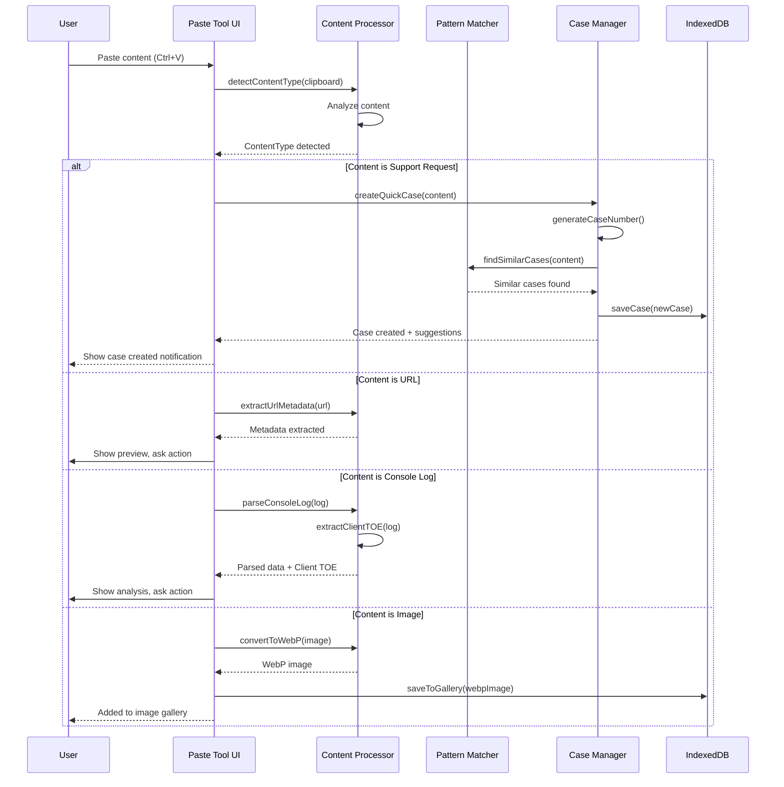
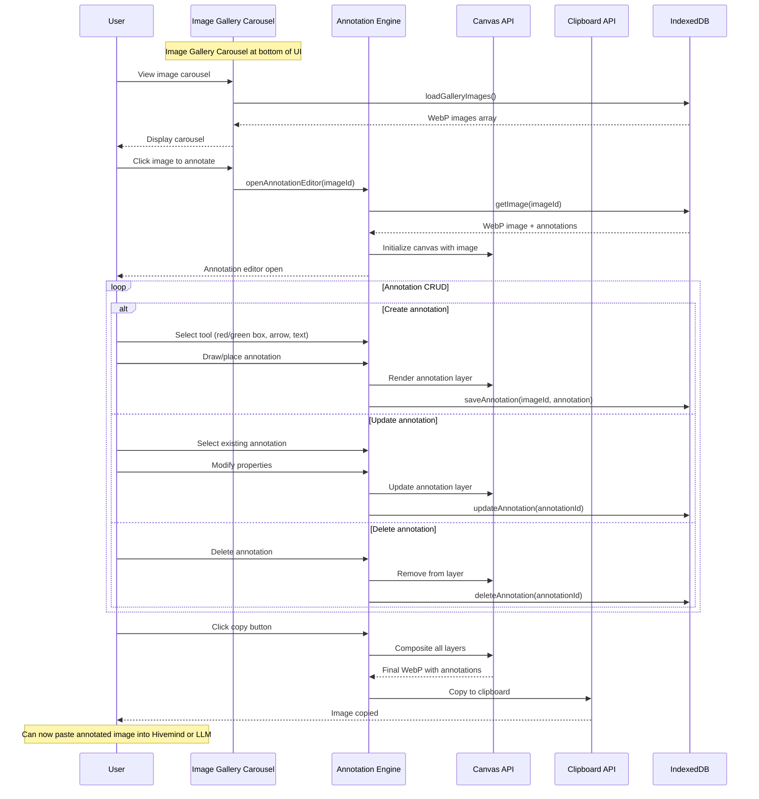
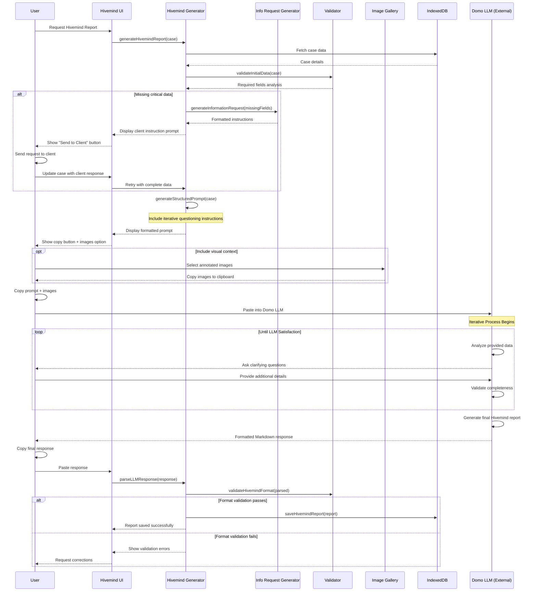
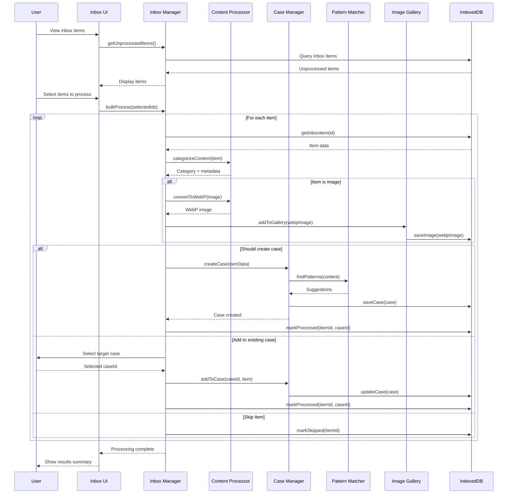

# Core Workflows

## Case Creation from Paste

```mermaid
sequenceDiagram
    participant User
    participant UI as Paste Tool UI
    participant CP as Content Processor
    participant PM as Pattern Matcher
    participant CM as Case Manager
    participant DB as IndexedDB
    
    User->>UI: Paste content (Ctrl+V)
    UI->>CP: detectContentType(clipboard)
    CP->>CP: Analyze content
    CP-->>UI: ContentType detected
    
    alt Content is Support Request
        UI->>CM: createQuickCase(content)
        CM->>CM: generateCaseNumber()
        CM->>PM: findSimilarCases(content)
        PM-->>CM: Similar cases found
        CM->>DB: saveCase(newCase)
        CM-->>UI: Case created + suggestions
        UI-->>User: Show case created notification
    else Content is URL
        UI->>CP: extractUrlMetadata(url)
        CP-->>UI: Metadata extracted
        UI->>User: Show preview, ask action
    else Content is Console Log
        UI->>CP: parseConsoleLog(log)
        CP->>CP: extractClientTOE(log)
        CP-->>UI: Parsed data + Client TOE
        UI->>User: Show analysis, ask action
    else Content is Image
        UI->>CP: convertToWebP(image)
        CP-->>UI: WebP image
        UI->>DB: saveToGallery(webpImage)
        UI-->>User: Added to image gallery
    end
```

## Image Gallery and Annotation Workflow

```mermaid
sequenceDiagram
    participant User
    participant Gallery as Image Gallery Carousel
    participant AE as Annotation Engine
    participant Canvas as Canvas API
    participant CB as Clipboard API
    participant DB as IndexedDB
    
    Note over Gallery: Image Gallery Carousel at bottom of UI
    
    User->>Gallery: View image carousel
    Gallery->>DB: loadGalleryImages()
    DB-->>Gallery: WebP images array
    Gallery-->>User: Display carousel
    
    User->>Gallery: Click image to annotate
    Gallery->>AE: openAnnotationEditor(imageId)
    AE->>DB: getImage(imageId)
    DB-->>AE: WebP image + annotations
    AE->>Canvas: Initialize canvas with image
    AE-->>User: Annotation editor open
    
    loop Annotation CRUD
        alt Create annotation
            User->>AE: Select tool (red/green box, arrow, text)
            User->>AE: Draw/place annotation
            AE->>Canvas: Render annotation layer
            AE->>DB: saveAnnotation(imageId, annotation)
        else Update annotation
            User->>AE: Select existing annotation
            User->>AE: Modify properties
            AE->>Canvas: Update annotation layer
            AE->>DB: updateAnnotation(annotationId)
        else Delete annotation
            User->>AE: Delete annotation
            AE->>Canvas: Remove from layer
            AE->>DB: deleteAnnotation(annotationId)
        end
    end
    
    User->>AE: Click copy button
    AE->>Canvas: Composite all layers
    Canvas-->>AE: Final WebP with annotations
    AE->>CB: Copy to clipboard
    CB-->>User: Image copied
    
    Note over User: Can now paste annotated image into Hivemind or LLM
```

## Hivemind Report Generation with Iterative LLM Process

```mermaid
sequenceDiagram
    participant User
    participant UI as Hivemind UI
    participant HG as Hivemind Generator
    participant IRG as Info Request Generator
    participant Val as Validator
    participant Gallery as Image Gallery
    participant DB as IndexedDB
    participant LLM as Domo LLM (External)
    
    User->>UI: Request Hivemind Report
    UI->>HG: generateHivemindReport(case)
    HG->>DB: Fetch case data
    DB-->>HG: Case details
    
    HG->>Val: validateInitialData(case)
    Val-->>HG: Required fields analysis
    
    alt Missing critical data
        HG->>IRG: generateInformationRequest(missingFields)
        IRG-->>HG: Formatted instructions
        HG-->>UI: Display client instruction prompt
        UI-->>User: Show "Send to Client" button
        
        User->>User: Send request to client
        User->>UI: Update case with client response
        UI->>HG: Retry with complete data
    end
    
    HG->>HG: generateStructuredPrompt(case)
    Note over HG: Include iterative questioning instructions
    
    HG-->>UI: Display formatted prompt
    UI-->>User: Show copy button + images option
    
    opt Include visual context
        User->>Gallery: Select annotated images
        Gallery-->>User: Copy images to clipboard
    end
    
    User->>User: Copy prompt + images
    User->>LLM: Paste into Domo LLM
    
    Note over LLM: Iterative Process Begins
    loop Until LLM Satisfaction
        LLM->>LLM: Analyze provided data
        LLM-->>User: Ask clarifying questions
        User->>LLM: Provide additional details
        LLM->>LLM: Validate completeness
    end
    
    LLM->>LLM: Generate final Hivemind report
    LLM-->>User: Formatted Markdown response
    
    User->>User: Copy final response
    User->>UI: Paste response
    UI->>HG: parseLLMResponse(response)
    HG->>Val: validateHivemindFormat(parsed)
    
    alt Format validation passes
        HG->>DB: saveHivemindReport(report)
        HG-->>UI: Report saved successfully
    else Format validation fails
        HG-->>UI: Show validation errors
        UI-->>User: Request corrections
    end
```

## Inbox Processing Workflow

```mermaid
sequenceDiagram
    participant User
    participant UI as Inbox UI
    participant IM as Inbox Manager
    participant CP as Content Processor
    participant CM as Case Manager
    participant PM as Pattern Matcher
    participant Gallery as Image Gallery
    participant DB as IndexedDB
    
    User->>UI: View inbox items
    UI->>IM: getUnprocessedItems()
    IM->>DB: Query inbox items
    DB-->>IM: Unprocessed items
    IM-->>UI: Display items
    
    User->>UI: Select items to process
    UI->>IM: bulkProcess(selectedIds)
    
    loop For each item
        IM->>DB: getInboxItem(id)
        DB-->>IM: Item data
        IM->>CP: categorizeContent(item)
        CP-->>IM: Category + metadata
        
        alt Item is image
            IM->>CP: convertToWebP(image)
            CP-->>IM: WebP image
            IM->>Gallery: addToGallery(webpImage)
            Gallery->>DB: saveImage(webpImage)
        end
        
        alt Should create case
            IM->>CM: createCase(itemData)
            CM->>PM: findPatterns(content)
            PM-->>CM: Suggestions
            CM->>DB: saveCase(case)
            CM-->>IM: Case created
            IM->>DB: markProcessed(itemId, caseId)
        else Add to existing case
            IM->>User: Select target case
            User-->>IM: Selected caseId
            IM->>CM: addToCase(caseId, item)
            CM->>DB: updateCase(case)
            IM->>DB: markProcessed(itemId, caseId)
        else Skip item
            IM->>DB: markSkipped(itemId)
        end
    end
    
    IM-->>UI: Processing complete
    UI-->>User: Show results summary
```