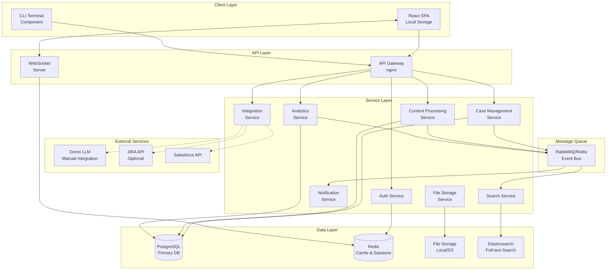

# High Level Architecture

## Technical Summary

The Smart Support Agent Application employs a containerized microservices architecture built on Node.js and React, designed to support multi-user collaboration through intelligent automation and sophisticated case management. The system leverages PostgreSQL for primary data storage with Redis for caching and real-time features, implementing event-driven patterns for asynchronous processing and WebSocket connections for live updates. Core architectural patterns include Repository Pattern for data access, Command Query Responsibility Segregation (CQRS) for complex operations, and a manual integration pattern with Domo's LLM service to maintain security while enabling AI-enhanced features.

## High Level Overview

1. **Architectural Style**: Microservices Architecture with Event-Driven Communication
   - Chosen for scalability, independent service deployment, and team autonomy
   - Services communicate via REST APIs and message queues

2. **Repository Structure**: Monorepo
   - Single repository containing all services, shared libraries, and infrastructure
   - Enables atomic commits across services and simplified dependency management

3. **Service Architecture**: Microservices
   - Core Services: Auth Service, Case Management Service, Content Processing Service, Analytics Service, Integration Service
   - Support Services: Notification Service, File Storage Service, Search Service

4. **Primary User Interaction Flow**:
   - Users interact through React-based SPA
   - API Gateway handles routing and authentication
   - Services process requests asynchronously where appropriate
   - Real-time updates via WebSocket connections

5. **Key Architectural Decisions**:
   - **Containerization**: All services run in Docker containers for consistency
   - **Local-First Storage**: Optimize for performance with background sync
   - **Manual LLM Integration**: Security-conscious approach to AI features
   - **Event Sourcing**: For audit trails and case history

## High Level Project Diagram

## Architectural and Design Patterns

- **Microservices Architecture:** Independent services with single responsibilities - *Rationale:* Enables independent scaling, deployment, and team ownership while supporting the complex feature set
- **Repository Pattern:** Abstract data access logic across all services - *Rationale:* Enables testing, maintains consistency, and allows future database migration flexibility
- **Event-Driven Communication:** Using message queues for service decoupling - *Rationale:* Supports async processing, system resilience, and enables real-time features
- **CQRS Pattern:** Separate read and write models for complex operations - *Rationale:* Optimizes performance for analytics and reporting while maintaining data integrity
- **API Gateway Pattern:** Single entry point for all client requests - *Rationale:* Centralizes authentication, routing, and cross-cutting concerns
- **Circuit Breaker Pattern:** Fault tolerance for external service calls - *Rationale:* Prevents cascade failures when integrating with Domo, Salesforce, or other external APIs
- **Local-First with Sync:** Client-side storage with background synchronization - *Rationale:* Provides instant UI response and offline capability while maintaining data consistency
- **Manual LLM Integration Pattern:** Copy-paste workflow with structured prompts - *Rationale:* Maintains security boundaries while leveraging AI capabilities